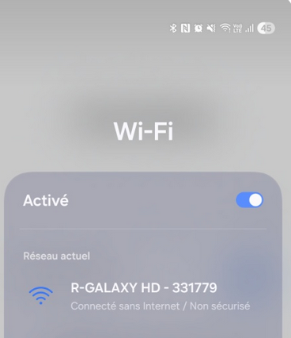
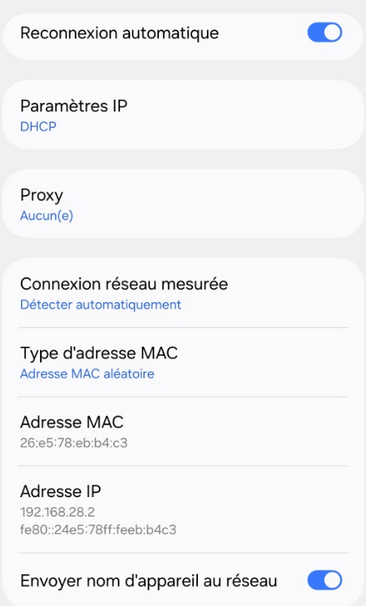
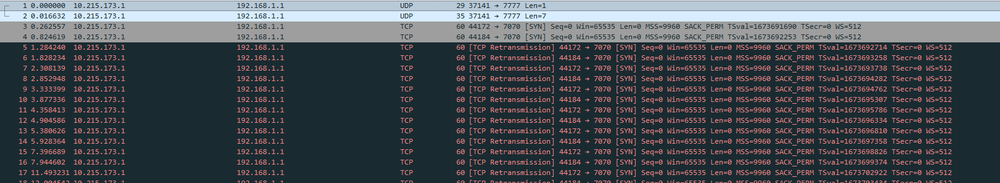
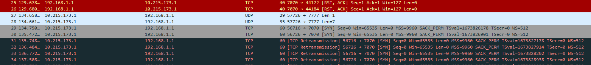
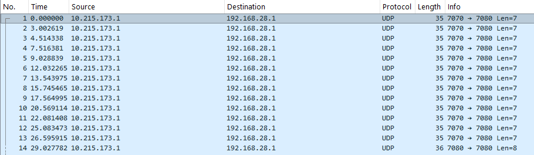
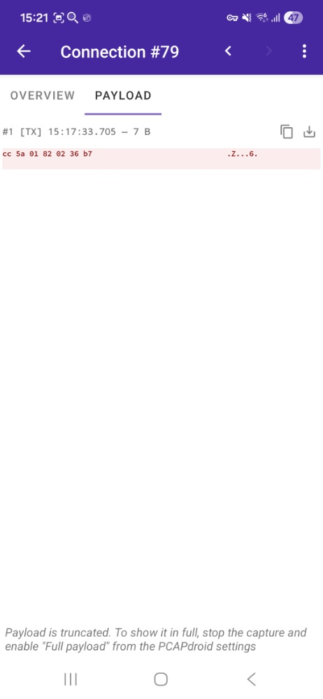

# Audit de Sécurité IoT : Drone PNJ Galaxy HD
IoT-Audit : Analyse de la surface d'attaque et des risques de confidentialité (Drone PNJ)

## 📋 Sommaire
1. [I. Introduction](#i-introduction)
2. [II. Couche Dispositif (Device)](#ii-dispositif)
3. [III. Couche Réseau (Network)](#iii-reseau)
4. [IV. Couche de Soutien (Support)](#iv-soutien)
5. [V. Couche Application](#v-application)
6. [VI. Conclusion et axes d'amélioration](#vi-conclusion)

## I. Introduction

Ce projet a été réalisé dans le cadre de mon intérêt pour les objets connectés (IoT). J’ai donc pris la décision d’acheter un drone à bas prix pour l’analyser afin de savoir si les drones vendus en grandes surfaces en France étaient protégés. Pour information, ces drones sont accessibles à tout le monde mais recommandés à partir de 14 ans. Ainsi, des mineurs peuvent les utiliser.
Ce projet aura pour but d’analyser si ce drone est sécuritaire ou non et cela à tous les niveaux.

Matériel utilisé :
Un drone PNJ Galaxy HD acheté en grande surface, IoT grand public
Une télécommande de drone
Un téléphone Android 16 avec l’application PCAPdroid
Le logiciel Wireshark depuis un ordinateur Windows 11 comme OS

Méthodologie :
Je me réfère à l’International Telecommunication Union – ITU-T Y.4000. Cette norme définit l’architecture de l’IoT selon quatre couches distinctes, ce qui permet de structurer l'analyse de la surface d'attaque : 

Couche Dispositif (Device) : Analyse du matériel et du point d'accès Wi-Fi ouvert
Couche Réseau (Network) : Étude des protocoles de transport (UDP/TCP) et des flux via Wireshark
Couche de Soutien (Service/Support) : Analyse des communications
Couche Application : Application mobile et permissions

## II. Couche Dispositif (Device)

Le drone PNJ Galaxy HD est fabriqué en Chine par Guanxu Technology. Celui-ci dispose d’une caméra HD proposant du 780P pour les médias. Il est doté de différents capteurs pour la télémétrie. On peut les citer :

Le Capteur Vidéo / Caméra 
Le Capteur d’Orientation (Gyroscope / Accéléromètre) 
Le Capteur d’Altitude 

Nous n’avons pas de capteur GPS intégré. L'accès physique à ces composants est ouvert dès la mise sous tension, sans mécanisme d'authentification matériel.

**Aperçu du matériel :**

## III. Couche Réseau (Network)

| Élément | Rôle | Adresse IP |
| :--- | :--- | :--- |
| **Drone (AP)** | Passerelle par défaut (Gateway A) | `192.168.1.1` |
| **Drone (AP)** | Passerelle par défaut (Gateway B) | `192.168.28.1` |
| **Smartphone** | Interface de capture PCAPdroid (VPN) | `10.215.173.1` |

La connexion au point d’accès du drone ne requiert aucune clé (Open Wi-Fi). L’absence de protocole WPA2/WPA3 permet une interception immédiate du trafic par n’importe quel attaquant à portée de signal.

Depuis l’application PCAPdroid, j’ai pu capturer les paquets avant de les exporter en.pcap. En analysant les logs sur Wireshark, je me suis aperçu de plusieurs points critiques. En effet, les services sont exposés en clair. Comme il n’y a pas de protocole TLS, plusieurs points critiques sont visibles :

Port 7777 (UDP) 
Flux de pilotage. Les commandes sont envoyées via des trames de 7 octets. L'absence de chiffrement permettrait à un attaquant d'injecter ses propres commandes pour détourner le drone. 

Ports 7070 et 7080 (TCP) 
Flux vidéo et commandes multimédias. Le flux est interceptable en temps réel, portant atteinte à la vie privée de l'utilisateur. 

### 📸 Preuves d'Audit et Analyses de Flux

Ci-dessous, les captures d'écran réalisées lors de l'interception des flux entre le drone et le smartphone (Android 16).

| Capture | Description Technique |
| :--- | :--- |
|  | **Info WiFi 1** : Configuration initiale du point d'accès. |
|  | **Info WiFi 2** : Détails des paramètres IP et DNS du drone. |
|  | **Première Analyse** : Identification des premiers échanges TCP/UDP. |
|  | **Seconde Analyse** : Confirmation de la stabilité des flux vidéos. |
|  | **Déni de Service / Spam** : Observation du flux constant de paquets de pilotage. |
|  | **Analyse Payload** : Structure de la trame de 7 octets (Commandes de vol). |

